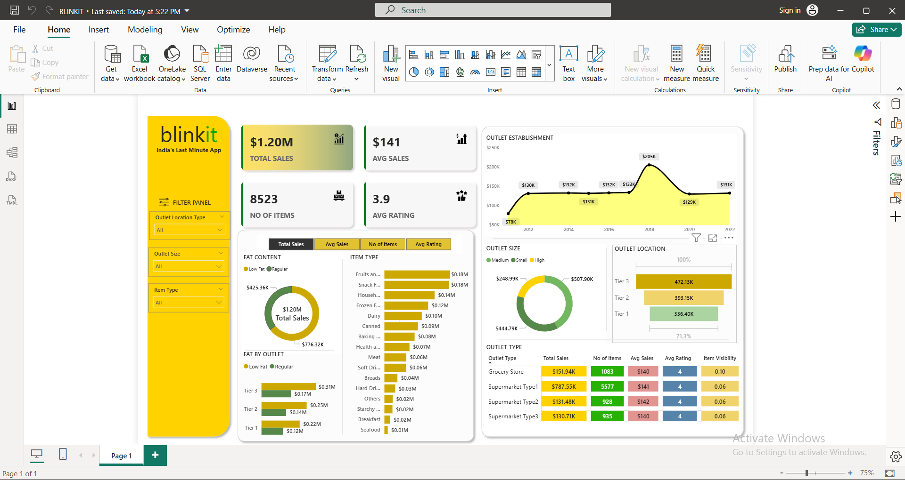

# 📊 Blinkit Sales Performance Dashboard (Power BI)

This repository contains a **Power BI dashboard** designed to analyze and visualize **Blinkit’s sales performance**, item distribution, and outlet insights.  
The dashboard provides an interactive and data-driven view of sales trends, item ratings, and outlet-level performance metrics to support business decision-making.

---

## 🚀 Features

- **Total Sales Overview:** Displays total revenue and average sales across all outlets.
- **Item Insights:** Breakdown of item categories by sales, number of items, and average rating.
- **Outlet Analysis:** Insights into outlet types, locations, and sizes.
- **Fat Content Distribution:** Sales comparison between low-fat and regular items.
- **Time-Based Trends:** Visualization of outlet establishment performance over the years.
- **Dynamic Filtering:** Adjustable filters for:
  - Outlet Location Type
  - Outlet Size
  - Item Type

---

## 📈 Key Metrics

| Metric | Description |
|--------|--------------|
| 💰 **Total Sales** | $1.20M in total revenue |
| 📦 **No. of Items** | 8,523 items |
| ⭐ **Average Rating** | 3.9 out of 5 |
| 🏪 **Avg Sales per Outlet** | $141 |

---

## 🧠 Insights Highlight

- **Supermarket Type 1** and **Supermarket Type 2** are the top-performing outlets.
- **Tier 3 outlets** contribute the highest total sales.
- **Low-fat items** generate a significant portion of sales.
- **Sales peaked in 2018** with $205K in outlet establishment revenue.

---

## 🛠️ Tools & Technologies

- **Microsoft Power BI**
- **Excel / SQL Server** (for data sources)
- **Data Modeling & DAX**
- **Visualization & Dashboard Design**

---

## 📸 Dashboard Preview



---

## 📂 Repository Structure

├── Screenshot1.png # Dashboard preview
├── Blinkit_Sales.pbix # Power BI file (if included)
└── README.md # Project documentation

yaml
Copy code

---

## 💡 How to Use

1. Clone this repository:
   ```bash
   git clone https://github.com/<your-username>/blinkit-sales-dashboard.git
Open the .pbix file in Power BI Desktop.

Connect to your dataset or update data sources.

Explore filters and visuals for customized analysis.

🧾 Author
Created by: [Your Name]
📧 Contact: [your.email@example.com]
🔗 LinkedIn: [Your LinkedIn Profile]